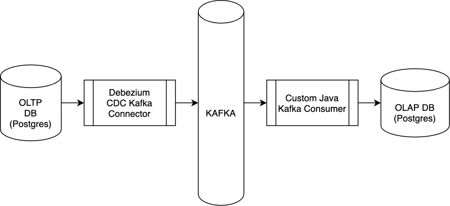

[Back to main README](../README.md)

---

# Iteration 1 - Solution 1



- The Debezium Kafka connector with generate CDC events and push them into kafka
- The [kafka consumer](https://github.com/sagnikbanerjeesb/oltp-olap-sync_cdc-processor-kafka) will:
    - Analyse the event and detect whether its an insert
    - If its an insert, try to form the full row and insert into OLAP DB
    
Given the current 2 tables: student and contact, the insert operation may be on either / both of them.

#### Say the insert is on student, E.g:

| student_id | name |
| --- | --- |
| 3 | Mary |

We'll take the PK from student (student_id) and execute the query:

```sql
SELECT
  student.student_id as student_id,
  contact.contact_id as contact_id,
  student.name as name,
  contact.contact_number as contact_number
FROM student
INNER JOIN contact
  ON student.student_id = contact.student_id
WHERE
  student.student_id = 3 # 3 comes from the insert record that we are analysing
```
    
If there is a corresponding record in contact, then we'll have a full row and and go ahead and insert it into the OLAP
DB.  
Else, we ignore this record

#### Now consider that the insert is on contact table. E.g.:

| contact_id | student_id (FK) | contact_number |
| --- | --- | --- |
| 4 | 3 | 101112 |

Here also we take the primary key of contact and execute the query:

```sql
SELECT
  student.student_id as student_id,
  contact.contact_id as contact_id,
  student.name as name,
  contact.contact_number as contact_number
FROM student
INNER JOIN contact
  ON student.student_id = contact.student_id
WHERE
  contact.contact_id = 4 # 4 comes from the insert record that we are analysing
```

If there is a corresponding record in student, we'll have a full row and proceed with insert into OLAP DB, else we 
ignore this event.

Now, it may also happen that:
1. Relational inserts were made to both student and contact
1. CDC events got generated for both student and contact
1. By the time we are processing the first CDC event, the source table already has corresponding entries in both student
and contact
1. Hence, as part of the first event, we will get the full row and insert it into the target DB
1. However, the next CDC event will also get the full row and try to insert. We have to make sure that the insert is
idempotent. Either it should fail, or update the record (preferably update)

#### Idempotent insert

Assuming that we have a unique index on (student_id, contact_id), below query will perform [upserts](https://www.postgresqltutorial.com/postgresql-upsert/).

```sql
INSERT INTO student_contact (student_id, contact_id, name, contact_number)  
  VALUES (?, ?, ?, ?)  
ON CONFLICT(student_id, contact_id)  
DO  
  UPDATE SET name = EXCLUDED.name, contact_number = EXCLUDED.contact_number;
```

